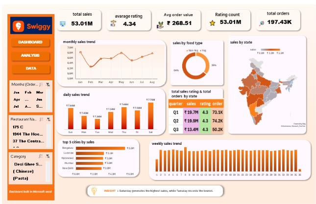

# 🍽️ Swiggy Sales Analysis Dashboard

## 📌 Overview

This project showcases an interactive **Microsoft Excel dashboard** built to analyze Swiggy sales data. The dashboard transforms raw data into meaningful business insights using data cleaning, Pivot Tables, Pivot Charts, Slicers, and KPI reporting.

It enables users to explore sales performance, customer behavior, food preferences, regional trends, and order patterns through an interactive and visually appealing dashboard.

---

## 🎯 Objectives

- Analyze overall sales performance
- Monitor monthly, weekly, and daily sales trends
- Compare food category performance
- Identify top-performing cities and states
- Evaluate quarterly business performance
- Build an interactive dashboard for business decision-making

---

## 📊 Dashboard KPIs

- **Total Sales:** ₹53.01M
- **Average Rating:** 4.34
- **Average Order Value:** ₹268.51
- **Total Orders:** 197.43K

---

## 📈 Dashboard Features

- Interactive Slicers
- KPI Cards
- Monthly Sales Trend
- Daily Sales Trend
- Weekly Sales Trend
- Sales by Food Type
- Sales by State
- Quarterly Sales Summary
- Top 5 Cities by Sales
- Business Insight Section

---

## 💡 Key Insights

- Saturday generated the highest sales, while Tuesday recorded the lowest sales.
- Bengaluru emerged as the highest revenue-generating city.
- Non-Veg orders contributed the largest share of total sales.
- Sales remained consistent throughout most weeks with a few noticeable peaks.

---

## 🛠️ Tools & Skills

- Microsoft Excel
- Pivot Tables
- Pivot Charts
- Slicers
- Data Cleaning
- Dashboard Design
- Data Visualization
- KPI Reporting
- Business Analysis

---

## 📁 Project Structure

```text
swiggy-sales-analysis-dashboard/
│── Swiggy_Sales_Dashboard.xlsx
│── Dashboard-preview.jpeg
│── README.md
```

---

## 📷 Dashboard Preview



---

## 📚 What I Learned

- Designing professional Excel dashboards
- Building interactive reports using slicers
- Creating meaningful KPIs for business analysis
- Visualizing sales trends across different dimensions
- Converting raw data into actionable business insights
- Improving dashboard usability through better layout and visual hierarchy
